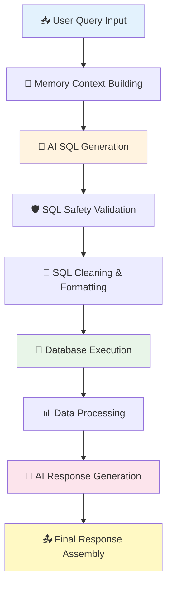

# Smart SQL Agent - Action Plan & Architecture

## 🎯 Smart SQL Agent Process Flow



## 🔍 Detailed Action Plan

### **STEP 1: Query Input Reception**
```
┌─────────────────────────────────────────────────────┐
│  📥 INPUT PROCESSING                                │
├─────────────────────────────────────────────────────┤
│  WHAT: process_query(user_query, user_preferences) │
│  TOOL: Python function parameter validation        │
│  WHY:  Clean input handling and type safety        │
│                                                     │
│  Example Input:                                     │
│    user_query = "find me cheap PG near college"    │
│    user_preferences = {"budget": 8000, ...}        │
└─────────────────────────────────────────────────────┘
```

### **STEP 2: Memory Context Building**
```
┌─────────────────────────────────────────────────────┐
│  🧠 CONTEXT PREPARATION                             │
├─────────────────────────────────────────────────────┤
│  WHAT: Convert preferences to JSON string          │
│  TOOL: json.dumps(user_preferences, indent=2)      │
│  WHY:  LLM needs structured, readable context      │
│                                                     │
│  Process:                                          │
│    preferences_dict → formatted JSON string        │
│    Used in both SQL generation and response        │
└─────────────────────────────────────────────────────┘
```

### **STEP 3: AI SQL Generation**
```
┌─────────────────────────────────────────────────────┐
│  🤖 INTELLIGENT SQL CREATION                        │
├─────────────────────────────────────────────────────┤
│  WHAT: LangChain chain for SQL generation          │
│  TOOL: ChatOpenAI + ChatPromptTemplate + Parser   │
│  WHY:  AI understands natural language → SQL      │
│                                                     │
│  Components:                                       │
│    • ChatPromptTemplate: Structured prompt        │
│    • ChatOpenAI(model="gpt-4o-mini", temp=0)     │
│    • StrOutputParser: Clean string output         │
│                                                     │
│  Chain Flow:                                       │
│    {schema, query, preferences} → prompt → LLM → SQL│
└─────────────────────────────────────────────────────┘
```

**Why ChatOpenAI?**
- **GPT-4o-mini**: Cost-effective, fast, accurate for SQL generation
- **Temperature=0**: Deterministic output for consistent SQL
- **LangChain**: Modular, maintainable chain architecture

### **STEP 4: SQL Safety Validation**
```
┌─────────────────────────────────────────────────────┐
│  🛡️ SECURITY LAYER                                 │
├─────────────────────────────────────────────────────┤
│  WHAT: is_safe_sql(sql_query) validation          │
│  TOOL: String matching against forbidden keywords  │
│  WHY:  Prevent SQL injection and data corruption  │
│                                                     │
│  Forbidden Operations:                             │
│    ❌ DELETE, DROP, UPDATE, INSERT                 │
│    ❌ ALTER, TRUNCATE, CREATE                      │
│    ✅ Only SELECT statements allowed               │
└─────────────────────────────────────────────────────┘
```

**Why String-based Validation?**
- **Simple & Effective**: Catches dangerous operations
- **Performance**: Fast validation without parsing overhead
- **Whitelist Approach**: Only allow safe SELECT operations

### **STEP 5: SQL Cleaning & Formatting**
```
┌─────────────────────────────────────────────────────┐
│  🔧 SQL PREPROCESSING                               │
├─────────────────────────────────────────────────────┤
│  WHAT: clean_sql(sql_query) function              │
│  TOOL: String manipulation and regex              │
│  WHY:  LLM outputs include markdown formatting    │
│                                                     │
│  Cleaning Process:                                 │
│    ```sql\nSELECT...\n``` → SELECT...            │
│    Remove code blocks and whitespace              │
│    Extract pure SQL from AIMessage content        │
└─────────────────────────────────────────────────────┘
```

### **STEP 6: Database Execution**
```
┌─────────────────────────────────────────────────────┐
│  💾 DATA RETRIEVAL                                 │
├─────────────────────────────────────────────────────┤
│  WHAT: Execute cleaned SQL against PostgreSQL     │
│  TOOL: psycopg2 database connector                │
│  WHY:  Direct, efficient database access          │
│                                                     │
│  Process:                                          │
│    1. Parse DATABASE_URL for connection params    │
│    2. Establish psycopg2.connect()               │
│    3. Execute SQL with cursor.execute()          │
│    4. Fetch results with column names            │
│    5. Convert to list of dictionaries            │
└─────────────────────────────────────────────────────┘
```

**Why psycopg2?**
- **Direct Connection**: No ORM overhead
- **PostgreSQL Optimized**: Native PostgreSQL adapter
- **Security**: Parameterized queries prevent injection

### **STEP 7: Data Processing**
```
┌─────────────────────────────────────────────────────┐
│  📊 RESULT TRANSFORMATION                           │
├─────────────────────────────────────────────────────┤
│  WHAT: Convert database rows to structured data   │
│  TOOL: Python dictionary comprehension            │
│  WHY:  JSON-serializable format for API response  │
│                                                     │
│  Transformation:                                   │
│    Raw tuples → [dict(zip(columns, row))]        │
│    Limit results to top 5 for performance        │
│    Prepare for LLM consumption                    │
└─────────────────────────────────────────────────────┘
```

### **STEP 8: AI Response Generation**
```
┌─────────────────────────────────────────────────────┐
│  🤖 NATURAL LANGUAGE FORMATTING                     │
├─────────────────────────────────────────────────────┤
│  WHAT: LangChain chain for response formatting    │
│  TOOL: ChatOpenAI + ChatPromptTemplate + Parser  │
│  WHY:  Convert raw data into conversational text  │
│                                                     │
│  Components:                                       │
│    • Input: {query, results, preferences}         │
│    • Prompt: "You are a helpful assistant..."     │
│    • LLM: Process and format naturally           │
│    • Output: Human-friendly response text        │
└─────────────────────────────────────────────────────┘
```

**Why Separate Formatting Chain?**
- **Specialized Prompts**: Different context for formatting vs SQL generation
- **Better Results**: Focused prompt engineering for each task
- **Modularity**: Easy to modify response style independently

### **STEP 9: Final Response Assembly**
```
┌─────────────────────────────────────────────────────┐
│  📤 RESPONSE CONSTRUCTION                           │
├─────────────────────────────────────────────────────┤
│  WHAT: Combine all components into API response   │
│  TOOL: Python dictionary construction             │
│  WHY:  Structured data for frontend consumption   │
│                                                     │
│  Response Structure:                               │
│    {                                              │
│      "type": "accommodation_search",              │
│      "query": original_query,                     │
│      "sql_generated": generated_sql,              │
│      "results_count": len(results),               │
│      "accommodations": results[:5],               │
│      "response": formatted_response,              │
│      "preferences": user_preferences              │
│    }                                              │
└─────────────────────────────────────────────────────┘
```

## 🎯 Technology Stack Justification

### **LangChain Framework**
```
✅ WHY CHOSEN:
  • Modular chain architecture
  • Built-in OpenAI integration
  • Prompt template management
  • Easy chain composition
  • Production-ready error handling

❌ ALTERNATIVES CONSIDERED:
  • Raw OpenAI API: Too much boilerplate
  • Custom framework: Reinventing the wheel
```

### **OpenAI GPT-4o-mini**
```
✅ WHY CHOSEN:
  • Cost-effective for production
  • Excellent SQL generation capability
  • Fast response times
  • Reliable natural language understanding

❌ ALTERNATIVES CONSIDERED:
  • GPT-4: Too expensive for production scale
  • Local models: Infrastructure complexity
  • Rule-based: Limited flexibility
```

### **PostgreSQL + psycopg2**
```
✅ WHY CHOSEN:
  • ACID compliance for data integrity
  • Excellent JSON support
  • Robust connection pooling
  • Direct driver for performance

❌ ALTERNATIVES CONSIDERED:
  • SQLAlchemy ORM: Too much overhead
  • SQLite: Not suitable for production
  • NoSQL: Structured accommodation data fits relational model
```

## 🔄 Error Handling Strategy

### **Database Errors**
```
Connection Failure → Return error response with fallback message
SQL Execution Error → Log error, return "try again" message
Empty Results → AI generates "no matches found" with suggestions
```

### **AI Errors**
```
OpenAI API Limit → Graceful fallback with cached responses
Invalid SQL Generated → Retry with simplified prompt
Network Timeout → Return partial results if available
```

### **Input Validation**
```
Malicious Input → Safety filter catches dangerous patterns
Empty Query → Return example queries for user guidance
Invalid Preferences → Use defaults and continue processing
```

This architecture ensures **reliability**, **security**, and **scalability** while providing an intelligent, conversational interface for accommodation search.